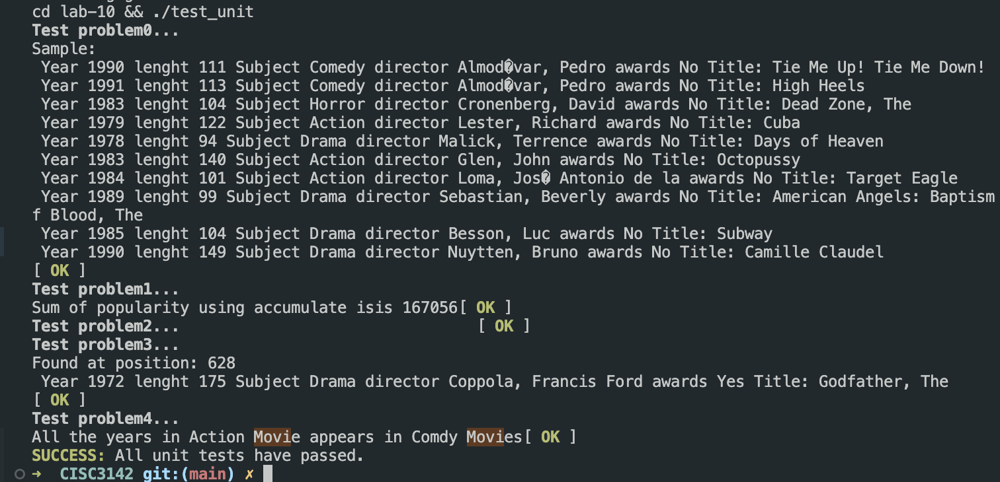

# Problem 10

## Get Started

Run 
```
make lab10
```

or if in macOS:
```
make lab10-mac
```


### Solution Proof



Tests available at test_unit.cpp

e.g. Test from Problem 2
```cpp
// Check if they are sorted by length
    int prev = INT_MAX;
    for (MovieInformation mvInfo: movieVect){
        TEST_ASSERT(mvInfo.length <= prev);
        prev = mvInfo.length;
    }
```


### Prompt


