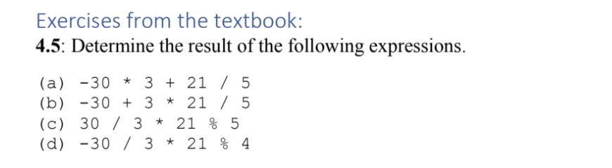

# Lab 5

## 4.5



Results

```
-85.8
-17.4
0
-2
```

## 417


```
prefix increments the value first before running the rest of the operation, while postfix increments the value before running any other operations
```

## 434


--- 

## Problem 1

I think the books exercises are more straight forward, I might as well sip them. 


Pseudo code

```cpp
int main(){
    int result = 0;
    long enterInput
    cin >> enterInput
    // for(auto c : enterInput) result += char(enterinput)
    while (enterInput > 0){
        
        
        
        int num = enterinput % 10;
        enterInput /= 10;
        result += num;
    }
    cout << "Sum of digits fo the number 7865 is: " << enterInput;
}

```

## Problem 2

Prime Numbers


Idea
```
for each number from recursivelly calclate if the number is prime? or check if the number divided each another 
The inefficient way is to run each number.


```

```cpp
int main(){
    const int MIN_NUM = 3, MAX_NUM = 100;
    vector<int> primeNumbers;

    for(int i = MIN_NUM; i< MAX_NUM; i++){
        for(int j = 2; j < i ; j++){
            if(i % j == 0){
                break;
            }
        }
        if(j == i) {
            // Then you add the num to primes
            // primeNumbers.push_back(i);
            cout << i;
        }


    }
}

```

```
**Using Dynamic Programming**
Another idea is to have a list of prime numbers and knowing that it will be not 
```


```cpp
int main(){
    const int MIN_NUM = 3, MAX_NUM = 100;
    vector<int> primeNumbers = {2};

    for(int i = MIN_NUM; i< MAX_NUM; i++){
        for(int j : primeNumbers){
            if(i % j == 0){
                break;
            }
        }
        if(j != i) {
            // Then you add the num to primes
            primeNumbers.push_back(i);
            cout >> i >> endl;
        }
    }
}

```

## Problem 3


Idea
```
Loop for each line and then save it on x and y.
you could use getline
Then you want to run the operations
```


```cpp
struct dot{
    int x=0;
    int y=0;
};

class Point{

}

int main(){
    string inputfilename = "enter.txt";
    inputFile.open(inputfilename);

    int sumX = 0;
    int sumY = 0;
    vector<int> xarr;
    vector<int> yarr;
    int x, y;
    int countLines = 0;
    // If inputfilename found, and able to open it, process each line, add to the counter
    if ( inputFile.is_open() ) {
        while ( inputFile ) { 
            getline (inputFile, myline);
            // ProrcessLine(myline, myline.length(), writeFile, countCharactersStripped);

            cin >> x >> y;
            // xarr.push_back(x);
            // xarr.push_back(x);

            sumX+=y;
            sumY+=x;
            countLines++;
            
        }
    }

    // Calculate means
    double meanX = sumX/countLines;
    double meanY = sumY/countLines;

    // Calculate X meanSquares
    double b1x = sumX - meanX * countLines;
    double b1y = sumX - meanX * countLines;

    // Calculate Y meanSquares


}


```


