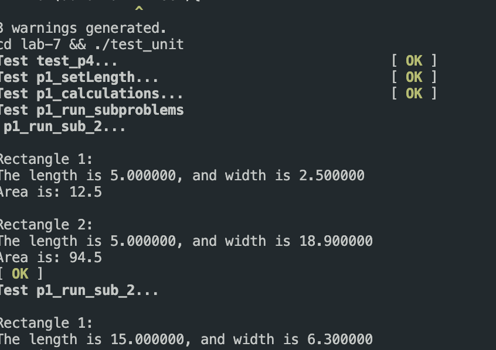
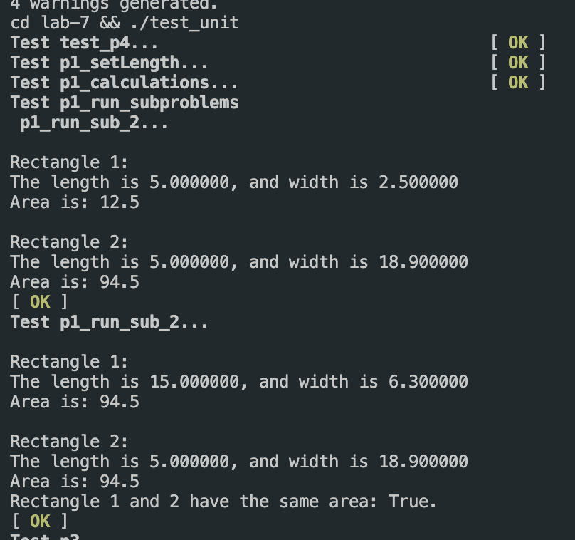
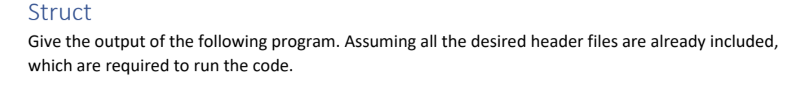
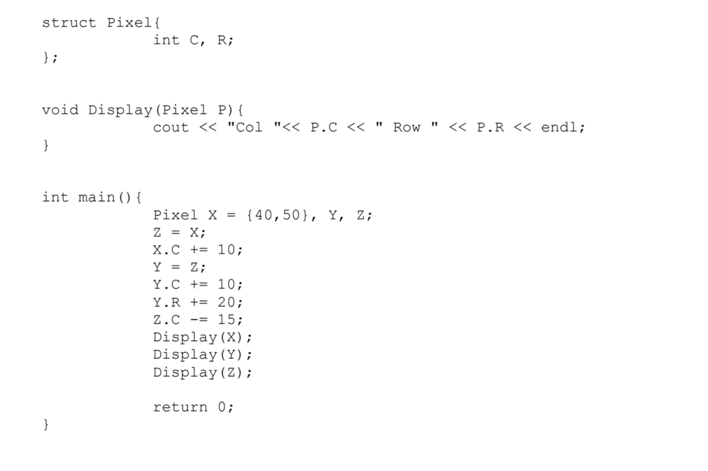

# Lab 7

For this lab I created few unit test to test that every function is working properly


Run the following to run the makefiles from the root directory:


```makefile
make lab7
```

Expected Output:




### Problem 1



### Problem 2


### Problem 3

Prompt:





```
Col 50 Row 50
Col 50 Row 70
Col 25 Row 50
```


