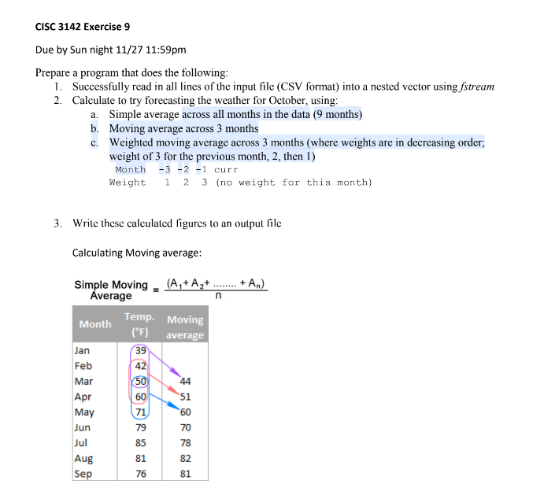
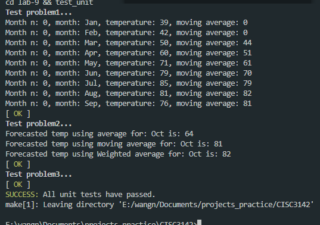
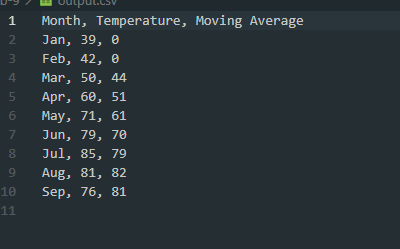
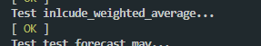
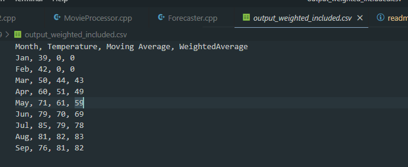
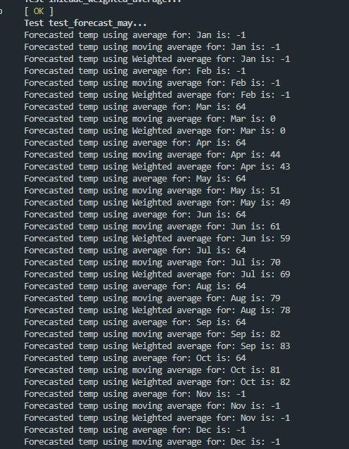

# Exercise 9

## Getting Started

For windows run:
```
make lab9
```

For mac run:

```
make lab9-mac
```

## Prompt





Output file...



## Extras

### Create also csv for weigted average 

This is supported by setting as true for including both average and weighted.

```cpp
tempP.to_csv("output_weighted_included.csv", true, true);
```


Testcase:

```
inlcude_weighted_average
```






### Forecasting all months

